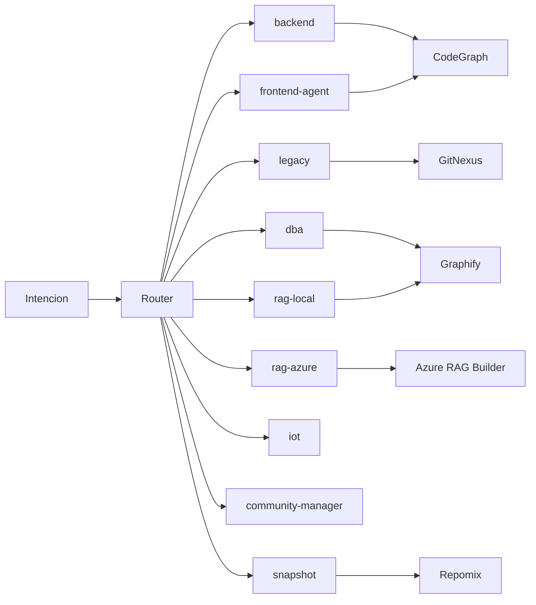

# AGENTS.md — Enterprise Global Contract

## Routing base

| Intención | Fuente | Agente | Motor |
|---|---|---|---|
| Bug/fix/refactor/test | Código repo único | backend | CodeGraph |
| Frontend/UI implementación | Código frontend repo único | frontend-agent | CodeGraph |
| Legacy/migración/multi-repo | Código legacy | legacy | GitNexus |
| SQL/schema/procedure | SQL/docs técnicas | dba | Graphify |
| UX/UI/design system | Guías de diseño y patrones UI | ux-ui | Graphify |
| Knowledge local/docs técnicas | Docs locales | rag-local | Graphify |
| Contratos/SLA/SharePoint/políticas | Docs corporativos | rag-azure | Azure RAG Builder |
| IoT/edge/telemetría | Código + docs | iot | GitNexus/CodeGraph + Graphify |
| Formación/posts/storytelling | Knowledge generado | community-manager | Graphify |
| Exportar contexto | Repo/docs | snapshot | Repomix |

## Optimización obligatoria

- Aplicar Token Saver antes de cualquier retrieval amplio.
- Aplicar Caveman Mode en loops de debug/coding, salvo que el usuario pida detalle.
- No sacrificar citas/fuentes por ahorrar tokens cuando la tarea requiere grounding.

## Reglas

- No usar todos los motores a la vez.
- No usar Azure RAG Builder para modificar código.
- No usar CodeGraph para buscar contratos.
- No usar Repomix como contexto vivo.
- Si no hay grounding suficiente, declarar gap.

## Boost-First Always-On

Regla obligatoria para todos los agentes:

1. Antes de cualquier edicion o ejecucion de cambios, aplicar seleccion explicita de boost/agente/skill.
2. En cada tarea, exponer evidencia minima de ejecucion: boost/agente/skill, motor, fallback (si aplica), validacion.
3. Cuando la tarea afecte a un proyecto concreto, persistir trazabilidad en `projects/<nombre-proyecto>/analysis_mcpee/`.
4. Si no se puede aplicar el motor esperado (index stale, tool no disponible, etc.), declarar gap y fallback en la salida.

## Primera Pasada Por Boost

Regla obligatoria para todos los agentes:

1. La primera pasada sobre un boost, capability o proyecto nuevo debe ser de
  onboarding profundo y con grounding máximo relevante, aunque tarde más.
2. En esa primera pasada se debe recuperar la mayor cantidad de contexto útil
  y verificable posible desde las fuentes canónicas del boost: repo-intake,
  onboarding, instrucciones, prompts, skills, agentes locales y documentación
  del propio proyecto.
3. Si el boost o proyecto define agentes o subagentes especializados, el
  agente principal debe usarlos cuando estén disponibles o, como mínimo,
  leerlos y aplicar sus reglas como contrato operativo explícito.
4. Token Saver sigue activo: no implica lectura masiva ciega, sino pocas
  recuperaciones grandes, estructuradas y con alta densidad de evidencia.
5. Tras esa primera pasada profunda, las siguientes iteraciones vuelven al
  modo optimizado normal.

## Always-On Optimization

Caveman Mode y Token Saver están siempre activos para todos los agentes.

### Token Saver

Aplicar antes de cualquier consulta a CodeGraph, GitNexus, Graphify, Azure RAG Builder o Repomix.

### Caveman

Aplicar a toda respuesta. Por defecto usar Caveman Lite/Full según tarea.

### Excepción

No eliminar explicación necesaria, fuentes, validación ni contexto crítico. Si hace falta más detalle, cambiar intensidad, no desactivar la optimización.

## Memory-first + Learning

All agents MUST:

1. Select memory BEFORE using any tool
2. Use cross-memory when multiple domains are involved
3. Prefer memories over raw retrieval
4. Use previous successful patterns if available (learning)
5. Register execution feedback

Execution order:

Memory → Reasoning → Tool (if needed) → Learning

## Diagrama Visual De Routing

<!-- gitnexus:start -->
# GitNexus — Code Intelligence

This project is indexed by GitNexus as **mcp-efficiency-engine**. Use the GitNexus MCP tools to understand code, assess impact, and navigate safely.

> Index stale? Run `node .gitnexus/run.cjs analyze` from the project root — it auto-selects an available runner. No `.gitnexus/run.cjs` yet? `npx gitnexus analyze` (npm 11 crash → `npm i -g gitnexus`; #1939).

## Always Do

- **MUST run impact analysis before editing any symbol.** Before modifying a function, class, or method, run `impact({target: "symbolName", direction: "upstream"})` and report the blast radius (direct callers, affected processes, risk level) to the user.
- **MUST run `detect_changes()` before committing** to verify your changes only affect expected symbols and execution flows. For regression review, compare against the default branch: `detect_changes({scope: "compare", base_ref: "main"})`.
- **MUST warn the user** if impact analysis returns HIGH or CRITICAL risk before proceeding with edits.
- When exploring unfamiliar code, use `query({search_query: "concept"})` to find execution flows instead of grepping. It returns process-grouped results ranked by relevance.
- When you need full context on a specific symbol — callers, callees, which execution flows it participates in — use `context({name: "symbolName"})`.
- For security review, `explain({target: "fileOrSymbol"})` lists taint findings (source→sink flows; needs `analyze --pdg`).

## Never Do

- NEVER edit a function, class, or method without first running `impact` on it.
- NEVER ignore HIGH or CRITICAL risk warnings from impact analysis.
- NEVER rename symbols with find-and-replace — use `rename` which understands the call graph.
- NEVER commit changes without running `detect_changes()` to check affected scope.

## Resources

| Resource | Use for |
|----------|---------|
| `gitnexus://repo/mcp-efficiency-engine/context` | Codebase overview, check index freshness |
| `gitnexus://repo/mcp-efficiency-engine/clusters` | All functional areas |
| `gitnexus://repo/mcp-efficiency-engine/processes` | All execution flows |
| `gitnexus://repo/mcp-efficiency-engine/process/{name}` | Step-by-step execution trace |

## CLI

| Task | Read this skill file |
|------|---------------------|
| Understand architecture / "How does X work?" | `.claude/skills/gitnexus/gitnexus-exploring/SKILL.md` |
| Blast radius / "What breaks if I change X?" | `.claude/skills/gitnexus/gitnexus-impact-analysis/SKILL.md` |
| Trace bugs / "Why is X failing?" | `.claude/skills/gitnexus/gitnexus-debugging/SKILL.md` |
| Rename / extract / split / refactor | `.claude/skills/gitnexus/gitnexus-refactoring/SKILL.md` |
| Tools, resources, schema reference | `.claude/skills/gitnexus/gitnexus-guide/SKILL.md` |
| Index, status, clean, wiki CLI commands | `.claude/skills/gitnexus/gitnexus-cli/SKILL.md` |

<!-- gitnexus:end -->
