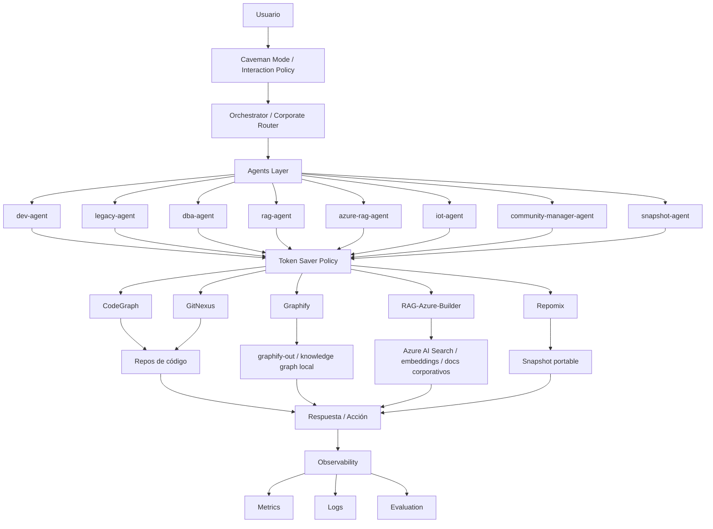

# Arquitectura final v6



## Lectura rápida

```txt
Caveman optimiza cómo se habla.
Token Saver optimiza qué contexto se usa.
Routing decide qué motor se usa.
Observability mide si todo funciona.
```
