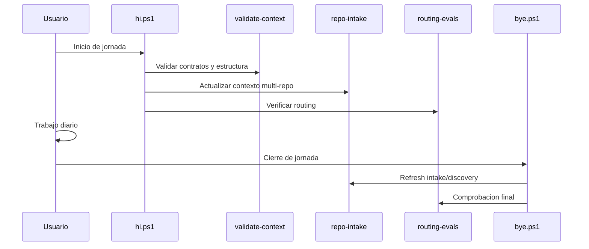

# Guía de uso — MCP Efficiency Engine

## 1. Cómo queda finalmente todo

La arquitectura final tiene seis bloques:

```txt
1. MCP para código vivo.
2. RAG local para conocimiento técnico.
3. Azure RAG Builder para documentos corporativos reales.
4. Repo Intake para usar todos tus repos sin copiarlos.
5. Token Saver para reducir contexto/coste.
6. Caveman Mode para reducir ruido de interacción.
```

## 2. Capas

```txt
Usuario
  ↓
Caveman Mode             -> controla cuánto y cómo responde el agente
  ↓
Orchestrator / Router    -> decide agente y motor
  ↓
Agente especializado     -> aplica rol
  ↓
Skill + Spec             -> aplica capacidad y reglas
  ↓
Token Saver              -> limita contexto, chunks, ficheros, tool calls
  ↓
Motor                    -> CodeGraph / GitNexus / Graphify / Azure RAG / Repomix
  ↓
Observability            -> mide routing, coste, grounding, eficiencia
```

## 3. Decisión de motor

```txt
Código repo único        -> CodeGraph
Código legacy/multi-repo -> GitNexus
Docs técnicas/locales    -> Graphify
Docs corporativos reales -> Azure RAG Builder
Export portable          -> Repomix
Repos externos           -> Repo Intake
```

## 4. Decisión de optimización

```txt
Problema de coste/contexto -> Token Saver
Problema de verbosidad     -> Caveman Mode
Problema de ambos          -> Token Saver + Caveman
```

## 5. Reglas prácticas

- Si el agente va a consultar datos: aplicar Token Saver.
- Si el usuario está en loop de debug/coding: aplicar Caveman Mode.
- Si la respuesta es para formación/documentación: Caveman puede relajarse.
- Si la respuesta necesita trazabilidad: no eliminar fuentes por Caveman.
- Si Azure RAG recupera demasiados chunks: limitar top-k y pedir solo fuentes necesarias.
- Si CodeGraph/GitNexus puede devolver símbolo/call path: no leer ficheros completos.

## 6. Regla final

```txt
No modelas repos.
Modelas capacidades.
No optimizas solo tokens.
Optimizas el pipeline completo.
```

## Always-On: decisión final

Token Saver y Caveman ya no son modos que se activan manualmente. Son parte del runtime del sistema.

```txt
Toda petición -> Caveman + Routing + Token Saver + Motor correcto
```

Esto significa:

- todas las respuestas serán más directas por defecto,
- todo retrieval se hará con contexto mínimo suficiente,
- las fuentes se conservan cuando sean obligatorias,
- el sistema solo aumenta detalle si el usuario o el caso lo requiere.

## 7. Instalación desde npm (rápido)

Instalación recomendada en proyecto host:

```powershell
npm install mcp-efficiency-engine
```

Si el entorno bloquea scripts de npm (`allow-scripts`), ejecutar manualmente:

```powershell
npm install mcp-efficiency-engine
npm approve-scripts mcp-efficiency-engine
npm rebuild mcp-efficiency-engine
```

Alternativa manual equivalente:

```powershell
npx mcp-efficiency-engine install
npx mcp-efficiency-engine validate -PortableMode
```

Validación de contenido publicado en npm:

```powershell
npm pack --dry-run
```

Debe listar, como mínimo, `bin/`, `scripts/`, `.github/`, `README.md`, `AGENTS.md`, `ARCHITECTURE.md` y `FINAL_USAGE_GUIDE.md`.

## 8. Telemetry Engine

El sistema incluye un engine de telemetría desacoplado con collector único.

Flujo:

```txt
Componente -> TelemetryCollector -> Pipeline -> Exporters
```

Exporters soportados:

- `console` (siempre disponible)
- `json` (persistencia local en `.telemetry/`)
- `langsmith` (opcional, solo con configuración válida)

Si un exporter falla:

- se registra warning,
- los demás exporters continúan,
- la ejecución principal no se detiene.

### Configuración rápida

Archivo `telemetry/config.json`:

```json
{
  "telemetry": {
    "enabled": true,
    "batch_size": 25,
    "telemetry_dir": ".telemetry",
    "exporters": ["console", "json", "langsmith"]
  },
  "langsmith": {
    "enabled": false,
    "api_key": "",
    "project": "",
    "endpoint": ""
  }
}
```

### Cómo activar LangSmith

1. Configurar `LANGSMITH_ENABLED=true`.
2. Definir `LANGSMITH_API_KEY` y `LANGSMITH_PROJECT`.
3. Mantener `langsmith` en `telemetry.exporters`.

Si falta configuración, se omite automáticamente.

## Flujo post-commit para proyectos consumidores

El install host configura hooks git locales (`core.hooksPath=.githooks`).

Hook incluido:

- `post-commit` -> `scripts/ops/post-commit-refresh.ps1`

Regla:

- Solo actua cuando el commit toca rutas bajo `projects/`.

Pipeline ejecutado en ese caso:

1. AutoDocs incremental (`scripts/wiki/compiler_main.py`)
2. Refresh de reportes de learning/value (`scripts/learning/*.py`)
3. Publicacion de snapshots KPI a LangSmith (`scripts/ops/publish-langsmith-kpis.py`)

Log de ejecucion:

- `observability/logs/session/post-commit-refresh-*.json`

### Cómo deshabilitar exporters

- Desactivar todo: `TELEMETRY_ENABLED=false`
- Solo algunos: `TELEMETRY_EXPORTERS=console,json`

## Diagrama Visual De Uso Diario


