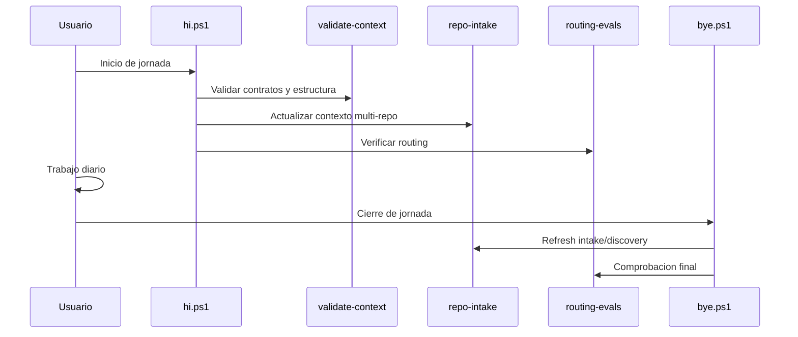

# Guía final de uso — MCP-First Enterprise Full v6

## 1. Cómo queda finalmente todo

La arquitectura final tiene seis bloques:

```txt
1. MCP para código vivo.
2. RAG local para conocimiento técnico.
3. Azure RAG Builder para documentos corporativos reales.
4. Repo Intake para usar todos tus repos sin copiarlos.
5. Token Saver para reducir contexto/coste.
6. Caveman Mode para reducir ruido de interacción.
```

## 2. Capas

```txt
Usuario
  ↓
Caveman Mode             -> controla cuánto y cómo responde el agente
  ↓
Orchestrator / Router    -> decide agente y motor
  ↓
Agente especializado     -> aplica rol
  ↓
Skill + Spec             -> aplica capacidad y reglas
  ↓
Token Saver              -> limita contexto, chunks, ficheros, tool calls
  ↓
Motor                    -> CodeGraph / GitNexus / Graphify / Azure RAG / Repomix
  ↓
Observability            -> mide routing, coste, grounding, eficiencia
```

## 3. Decisión de motor

```txt
Código repo único        -> CodeGraph
Código legacy/multi-repo -> GitNexus
Docs técnicas/locales    -> Graphify
Docs corporativos reales -> Azure RAG Builder
Export portable          -> Repomix
Repos externos           -> Repo Intake
```

## 4. Decisión de optimización

```txt
Problema de coste/contexto -> Token Saver
Problema de verbosidad     -> Caveman Mode
Problema de ambos          -> Token Saver + Caveman
```

## 5. Reglas prácticas

- Si el agente va a consultar datos: aplicar Token Saver.
- Si el usuario está en loop de debug/coding: aplicar Caveman Mode.
- Si la respuesta es para formación/documentación: Caveman puede relajarse.
- Si la respuesta necesita trazabilidad: no eliminar fuentes por Caveman.
- Si Azure RAG recupera demasiados chunks: limitar top-k y pedir solo fuentes necesarias.
- Si CodeGraph/GitNexus puede devolver símbolo/call path: no leer ficheros completos.

## 6. Regla final

```txt
No modelas repos.
Modelas capacidades.
No optimizas solo tokens.
Optimizas el pipeline completo.
```

## Always-On: decisión final

Token Saver y Caveman ya no son modos que se activan manualmente. Son parte del runtime del sistema.

```txt
Toda petición -> Caveman + Routing + Token Saver + Motor correcto
```

Esto significa:

- todas las respuestas serán más directas por defecto,
- todo retrieval se hará con contexto mínimo suficiente,
- las fuentes se conservan cuando sean obligatorias,
- el sistema solo aumenta detalle si el usuario o el caso lo requiere.

<!-- diagramas-v1 -->
## Diagrama Visual De Uso Diario


