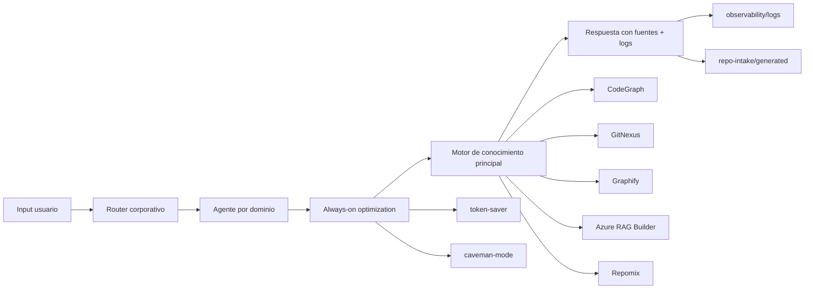
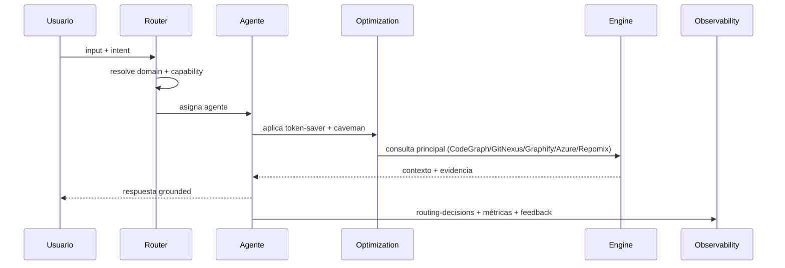
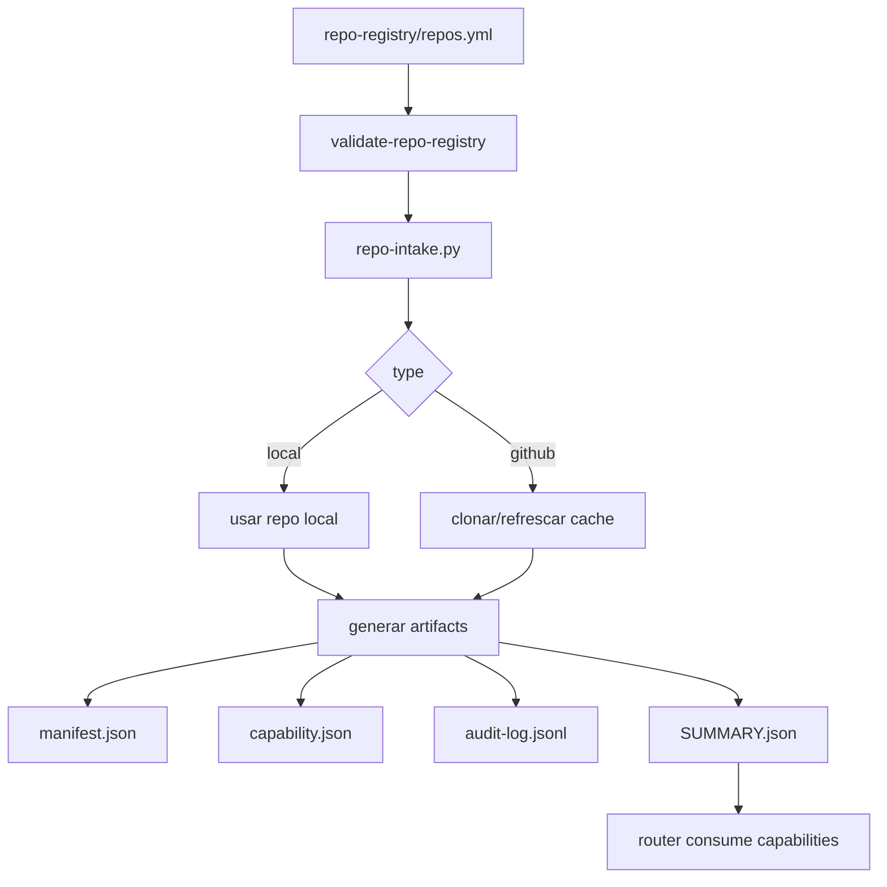
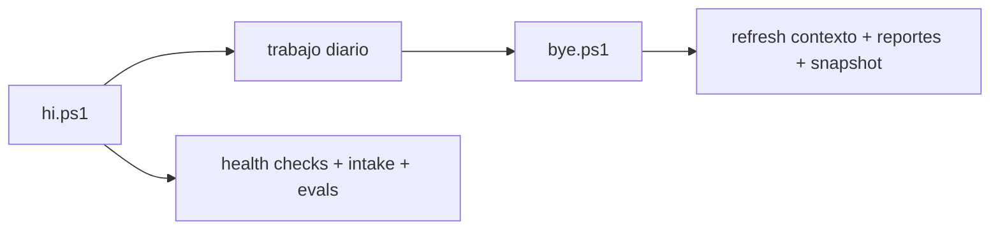
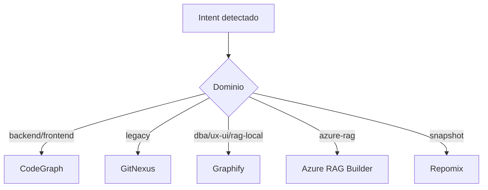
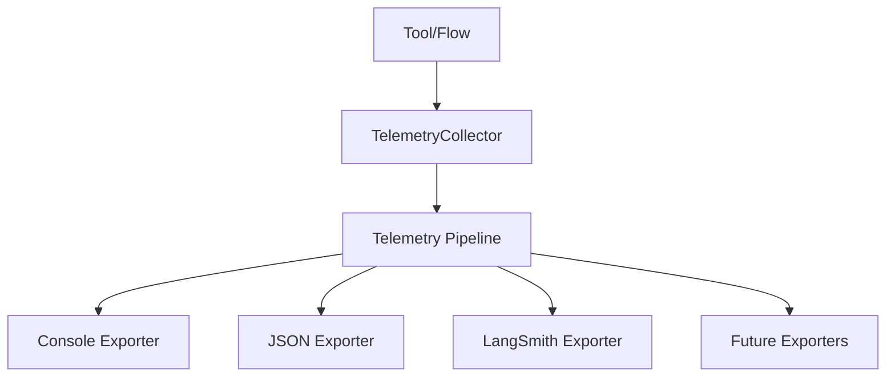
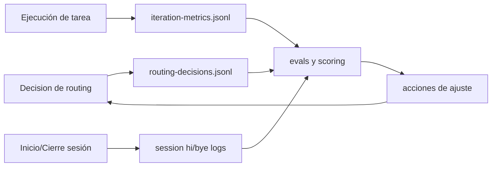
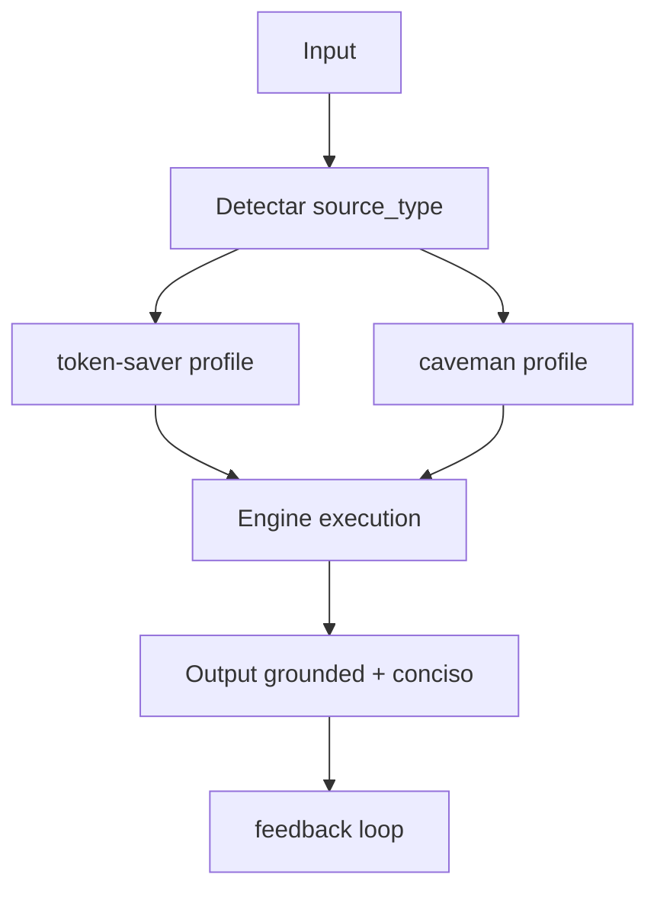
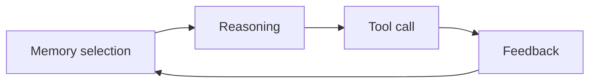
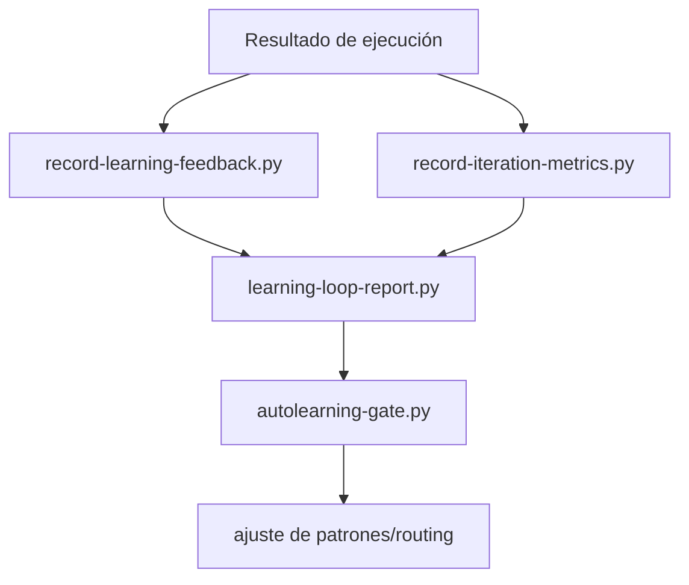

<!-- markdownlint-disable MD013 -->

# MCP Efficiency Engine

Motor de orquestación para agentes MCP con routing por dominio, optimización always-on y contratos de intake JSON-first.

## Objetivo

Este repositorio centraliza:

- Routing corporativo de intención -> agente -> motor.
- Ingesta de repos "boost" (locales o GitHub) a capacidades consumibles.
- Optimización operacional (`token-saver` + `caveman`) sin perder grounding.
- Observabilidad de decisiones de routing, uso y aprendizaje continuo.

## Arquitectura



## Flujos Operativos

### Flujo AutoDocs (wiki-agent)

Proyeccion incremental de conocimiento tecnico a Markdown:

```powershell
py -3 -m scripts.wiki.wiki_compiler
```

Artefactos de salida:

- `autodocs/generated/unified-graph.json`
- `autodocs/generated/validation-report.json`
- `autodocs/site/`

Automatizacion CI:

- `.github/workflows/autodocs-sync.yml`

### Flujo End-to-End De Routing



### Flujo De Intake (Registry -> Capability)



### Flujo Diario Recomendado



## Routing Base

Contrato global en `AGENTS.md`:

- `backend` -> `CodeGraph`
- `frontend-agent` -> `CodeGraph`
- `legacy` -> `GitNexus`
- `dba` -> `Graphify`
- `ux-ui` -> `Graphify`
- `rag-local` -> `Graphify`
- `rag-azure` -> `Azure RAG Builder`
- `iot` -> `GitNexus/CodeGraph + Graphify`
- `community-manager` -> `Graphify`
- `wiki-agent` -> `CodeGraph` (fallback `Graphify`)
- `snapshot` -> `Repomix`

## Motores Y Herramientas

### Motores Principales

| Motor | Uso principal | Cuándo usarlo |
|---|---|---|
| CodeGraph | Código repo único, símbolos y call paths | bug/fix/refactor backend o frontend en un repo |
| GitNexus | Impacto multi-repo, legacy, dependencias | migraciones legacy, análisis de blast radius, seguridad de cambio |
| Graphify | Documentación técnica local y relaciones de conocimiento | dba, ux-ui, rag-local, análisis de docs estructurados |
| Azure RAG Builder | Contexto corporativo y fuentes enterprise | contratos, políticas, evidencia corporativa |
| Repomix | Snapshot/export de contexto | empaquetado de contexto y handoff portable |

### Tooling Operativo Del Repo

| Tooling | Rol en el sistema |
|---|---|
| token-saver-mcp | reducción de contexto y coste sin perder evidencia |
| caveman-mode | simplificación de salida y disciplina de respuesta |
| codebase-memory-mcp | memoria persistente para patrones y feedback |
| scripts/intake/* | validación de registry, generación de capabilities y resolución de routing |
| scripts/ops/hi.ps1, scripts/ops/bye.ps1 | ciclo operativo de inicio/cierre con checks y refresh |
| observability/logs/* | trazabilidad de decisiones, métricas y aprendizaje |

### Mapa Rápido Intent -> Motor



## Estructura Clave

- `.github/agents/`: definición de agentes por dominio.
- `.github/skills/`: skills ejecutables y reutilizables.
- `.github/prompts/`: prompts de routing por caso.
- `orchestrator/`: reglas corporativas y matriz de decisión.
- `repo-registry/`: registro de boosts aprobados.
- `repo-intake/`: generación de manifests/capabilities/audit.
- `scripts/`: setup, intake, operaciones, contexto y learning.
- `observability/`: esquemas, métricas y evaluaciones.
- `projects/`: artefactos operativos por proyecto.

## Quickstart (Windows)

### 1) Setup inicial

```powershell
.\scripts\setup\setup-prerequisites.ps1
```

### Alternativa npm

Si quieres dejarlo auto-instalable en cualquier proyecto, el paquete ahora scaffoldéa el engine en el proyecto host durante `npm install` y luego ejecuta el bootstrap allí mismo.

Instalacion directa en un proyecto nuevo o existente:

```powershell
npm install mcp-efficiency-engine
```

Comportamiento esperado:

- copia al proyecto host los artefactos canonicos del engine (`scripts`, `.github`, `.vscode`, `repo-intake`, `orchestrator`, `policies`, `observability`, `autodocs/schema`, `memory`, etc.)
- instala motores y herramientas via bootstrap portable
- si no existe `repo-registry/repos.yml`, pregunta por owner/prefix y si quieres registrar un repo inicial para intake
- si no añades repos en ese momento, deja el registry plantilla listo para añadirlos despues y rerun de intake

Nota npm (entornos con politicas de scripts):

- si `npm` bloquea `install`/`postinstall` (por ejemplo con `allow-scripts`), el scaffold/bootstrapping puede no ejecutarse automaticamente
- en ese caso, aprueba scripts (`npm approve-scripts`) o ejecuta manualmente:

```powershell
npx mcp-efficiency-engine install
npx mcp-efficiency-engine validate -PortableMode
```

Tambien puedes relanzar la instalacion manualmente sobre el proyecto actual:

```powershell
npx mcp-efficiency-engine install
npx mcp-efficiency-engine validate -PortableMode
```

Tambien puedes instalarlo globalmente y usar:

```powershell
npm install -g mcp-efficiency-engine
mcpee install
```

### 2) Validación mínima

```powershell
.\scripts\setup\validate-context.ps1
.\scripts\intake\run-repo-intake.cmd
py -3 .\scripts\intake\run-routing-evals.py
```

### 3) Operación diaria

```powershell
.\scripts\ops\hi.ps1
# ... trabajo ...
.\scripts\ops\bye.ps1
```

Validación extendida recomendada:

```powershell
py -3 .\scripts\intake\agent-pipeline-preflight.py
py -3 .\scripts\intake\validate-repo-registry.py --strict
```

### Flujo automatico al hacer commit en projects/

Cuando instalas el engine en un proyecto host (`mcpee install`), se configura `core.hooksPath=.githooks` con un `post-commit` que ejecuta `scripts/ops/post-commit-refresh.ps1`.

Comportamiento del hook:

- si el ultimo commit no toca `projects/`, no hace nada
- si detecta cambios en `projects/`, ejecuta:
  - `scripts/wiki/compiler_main.py` (AutoDocs incremental)
  - `scripts/learning/learning-loop-report.py`
  - `scripts/learning/iteration-value-report.py`
  - `scripts/ops/publish-langsmith-kpis.py` (best effort)

Artefactos/resultados:

- AutoDocs actualizado en `autodocs/generated` y `autodocs/site`
- reportes de observabilidad actualizados en `observability/evals`
- snapshots KPI publicados a LangSmith para dashboards
- resumen local en `observability/logs/session/post-commit-refresh-*.json`

Instalacion manual de hooks (si necesitas reprovisionar):

```powershell
.\scripts\setup\install-project-hooks.ps1
```

## Flujo De Intake

`repo-intake` soporta dos modos:

- `type=local`: consume un repo existente en disco.
- `type=github`: clona/refresca cache local y genera los mismos artefactos.

Artefactos canónicos:

- `repo-intake/generated/<slug>/context-manifests/manifest.json`
- `repo-intake/generated/<slug>/capabilities/capability.json`
- `repo-intake/generated/<slug>/audit/audit-log.jsonl`
- `repo-intake/generated/reports/SUMMARY.json`

## Observabilidad

### Telemetry Engine (desacoplado y extensible)

La observabilidad ahora se soporta mediante un engine propio en `telemetry/`.

Principios:

- Telemetría siempre activa a nivel de modelo de datos.
- Exporters opcionales (`console`, `json`, `langsmith`).
- Ningún flujo de negocio depende de LangSmith.
- Si un exporter falla, la ejecución principal continua.

Arquitectura:



Trazas jerárquicas:

- Cada ejecución genera `execution_id`, `trace_id`, `span_id`, `parent_span_id`.
- Se propaga contexto con `contextvars` (sin variables globales).
- Spans soportan `events`, `status`, `duration_ms` y error asociado.

Configuración base (`telemetry/config.json`):

```json
{
  "telemetry": {
    "enabled": true,
    "batch_size": 100,
    "telemetry_dir": ".telemetry",
    "exporters": ["console", "json"]
  },
  "langsmith": {
    "enabled": false,
    "api_key": "",
    "project": "",
    "endpoint": "",
    "high_signal_only": true,
    "min_span_duration_ms": 100,
    "emit_execution_summary": true
  }
}
```

Conexión segura a LangSmith (sin subir token al repo/npm):

1. No guardes el token en `telemetry/config.json`.
2. Define variables de entorno locales (usuario o sesión).
3. Activa exporter por entorno con `TELEMETRY_EXPORTERS=console,json,langsmith`.
4. Verifica que `.env` y variantes están ignorados por Git y npm.

Ejemplo (PowerShell, solo sesión actual):

```powershell
$env:LANGSMITH_ENABLED='true'
$env:LANGSMITH_API_KEY='tu_token'
$env:LANGSMITH_PROJECT='mcpee-local'
$env:LANGSMITH_ENDPOINT='https://api.smith.langchain.com'
$env:LANGSMITH_HIGH_SIGNAL_ONLY='true'
$env:LANGSMITH_MIN_SPAN_DURATION_MS='100'
$env:LANGSMITH_EMIT_EXECUTION_SUMMARY='true'
$env:TELEMETRY_EXPORTERS='console,json,langsmith'
```

Persistente para tu usuario Windows:

```powershell
[System.Environment]::SetEnvironmentVariable('LANGSMITH_ENABLED','true','User')
[System.Environment]::SetEnvironmentVariable('LANGSMITH_API_KEY','tu_token','User')
[System.Environment]::SetEnvironmentVariable('LANGSMITH_PROJECT','mcpee-local','User')
[System.Environment]::SetEnvironmentVariable('LANGSMITH_ENDPOINT','https://api.smith.langchain.com','User')
[System.Environment]::SetEnvironmentVariable('LANGSMITH_HIGH_SIGNAL_ONLY','true','User')
[System.Environment]::SetEnvironmentVariable('LANGSMITH_MIN_SPAN_DURATION_MS','100','User')
[System.Environment]::SetEnvironmentVariable('LANGSMITH_EMIT_EXECUTION_SUMMARY','true','User')
[System.Environment]::SetEnvironmentVariable('TELEMETRY_EXPORTERS','console,json,langsmith','User')

Modo high-signal recomendado en LangSmith:

- `LANGSMITH_HIGH_SIGNAL_ONLY=true` (default): prioriza trazas útiles y reduce ruido.
- `LANGSMITH_MIN_SPAN_DURATION_MS=100` (default): solo mantiene spans rápidos cuando fallan; los de éxito deben superar el umbral.
- `LANGSMITH_EMIT_EXECUTION_SUMMARY=true` (default): añade un resumen consolidado por ejecución (duración, estado, warnings/errors, tokens/coste).
- Mantiene eventos clave (`ExecutionStarted`, `ExecutionFinished`, `RoutingResolved`, warnings/errores) y resumen `UsageSummary` con modelo/tokens/coste.
- Omite eventos de bajo valor para la UI de LangSmith, pero conserva debug detallado en exporters locales (`console`, `json`).
```

Para volver al modo local sin LangSmith:

```powershell
$env:LANGSMITH_ENABLED='false'
$env:TELEMETRY_EXPORTERS='console,json'
```

Troubleshooting rapido: no aparecen dashboards/runs en LangSmith

Importante: en LangSmith, los runs se validan primero en `Tracing` (y opcionalmente `Monitoring`). La seccion `Custom Dashboards` no se autogenera por defecto; puede aparecer vacia aunque la telemetria este funcionando correctamente.

Checklist minimo (debe cumplirse todo):

- `LANGSMITH_ENABLED=true`
- `LANGSMITH_API_KEY` definido
- `LANGSMITH_PROJECT` definido
- `TELEMETRY_EXPORTERS=console,json,langsmith`
- el flujo que ejecutas realmente emite telemetria (por ejemplo `hi.ps1`, intake o routing-evals)

Comprobacion en PowerShell:

```powershell
Write-Host "LANGSMITH_ENABLED=$env:LANGSMITH_ENABLED"
Write-Host "LANGSMITH_PROJECT=$env:LANGSMITH_PROJECT"
Write-Host "TELEMETRY_EXPORTERS=$env:TELEMETRY_EXPORTERS"
```

Si `LANGSMITH_WORKSPACE_ID` no coincide con tu workspace real, los runs pueden quedar en otro workspace y "no verse" en la UI esperada.

Verificacion local (aunque LangSmith falle):

- revisa que se siguen generando logs en `observability/logs/` (la app no debe romperse por un fallo del exporter)
- si hay trazas locales pero no runs remotos, el problema es de configuracion/conectividad de LangSmith y no del flujo principal

### Alinear KPIs locales con LangSmith

Para enviar a LangSmith los KPIs que ya calcula el engine en local (`learning-loop-report.json` e `iteration-value-report.json`) y poder construir dashboards con esa señal:

```powershell
npm run langsmith:kpis
```

Este comando publica runs de resumen con tags `mcpee`, `kpi`, `dashboard` y nombres:

- `KPI::LearningLoop`
- `KPI::IterationValue`
- `KPI::AlignmentSnapshot`

Con eso puedes filtrar en `Tracing` por `tag:kpi` y montar dashboards manuales en `Custom Dashboards` sobre esos runs.

Separacion plataforma vs proyecto consumidor:

- los runs KPI incluyen metadata y tags de scope automaticamente
- metadata: `host_project`, `host_project_slug`, `telemetry_scope` (`platform` o `consumer`)
- tags: `scope:<valor>` y `host:<slug>`

Ejemplos de filtro para un dashboard de proyecto consumidor:

- `Tag contains kpi`
- `Tag contains scope:consumer`
- `Tag contains host:<slug-del-proyecto>`

Si quieres forzar nombre de proyecto host (por ejemplo en CI):

```powershell
$env:MCPEE_HOST_PROJECT='mi-proyecto-app'
npm run langsmith:kpis
```

Variables de entorno soportadas:

- `TELEMETRY_ENABLED`
- `TELEMETRY_EXPORTERS`
- `TELEMETRY_BATCH_SIZE`
- `TELEMETRY_DIR`
- `LANGSMITH_ENABLED`
- `LANGSMITH_API_KEY`
- `LANGSMITH_PROJECT`
- `LANGSMITH_ENDPOINT`
- `LANGSMITH_WORKSPACE_ID` (opcional, recomendado para cuentas con multiples workspaces)

Nota: el engine carga automáticamente `.env` en la raíz del repo. Si también existe variable en el entorno del sistema/proceso, esa tiene prioridad.

Dependencia runtime: `langsmith` está incluida en `requirements.txt` para que `scripts/setup/setup-prerequisites.ps1` la instale automáticamente cuando prepares el entorno Python.

Cómo crear un exporter nuevo:

1. Implementar contrato `export/flush/shutdown` en `telemetry/exporters/<nuevo>/exporter.py`.
2. Registrar el exporter en `telemetry/bootstrap.py`.
3. Añadirlo en `telemetry/config.json` o `TELEMETRY_EXPORTERS`.

Si LangSmith no está configurado correctamente, el exporter se omite y el engine sigue funcionando con `console/json`.

Benchmark de overhead on/off:

```powershell
py -3 .\scripts\ops\telemetry-benchmark.py --iterations 10
```

Salida:

- `observability/evals/telemetry-overhead-benchmark.json`

Registros principales:

- `observability/logs/routing-decisions.jsonl`
- `observability/logs/iteration-metrics.jsonl`
- `observability/logs/session/hi-*.json`
- `observability/logs/session/bye-*.json`

Eventos clave que conviene revisar:

- decisiones de routing: agente, engine, fallback, grounding.
- requirements runtime por ruta resuelta.
- métricas por iteración (tokens/coste si se reportan).
- feedback de learning para mejorar rutas futuras.

### Loop De Observabilidad



## Optimización Always-On

Pilares:

- `token-saver`: reduce contexto sin romper grounding.
- `caveman`: simplifica salida y reduce ruido operacional.
- Selección de perfil por tipo de fuente (`code`, `technical-docs`, `corporate-docs`, `snapshot`).



Referencias:

- `optimization/ALWAYS_ON_OPTIMIZATION.md`
- `optimization/token-saver.md`
- `optimization/caveman-mode.md`

## Policies Y Guardrails

Políticas activas para gobierno, coste, seguridad y intake:

- `policies/context-policy.md`
- `policies/cost-policy.md`
- `policies/security-policy.md`
- `policies/repo-intake-policy.md`

Reglas operativas clave:

- No mezclar todos los motores a la vez.
- Priorizar evidencia y fuentes cuando aplique.
- En cambios de alto impacto, activar confirmación humana (HITL).
- Mantener outputs de proyecto dentro de `projects/<nombre>/`.

## Tooling Operativo

Mapa de toolchain por fase:

| Fase | Scripts/Tools |
|---|---|
| Setup | `scripts/setup/setup-prerequisites.ps1`, `scripts/setup/validate-context.ps1` |
| Intake | `scripts/intake/validate-repo-registry.py`, `scripts/intake/repo-intake.py`, `scripts/intake/run-repo-intake.cmd` |
| Routing/Evals | `scripts/intake/resolve-routing.py`, `scripts/intake/run-routing-evals.py`, `scripts/intake/agent-pipeline-preflight.py` |
| Daily Ops | `scripts/ops/hi.ps1`, `scripts/ops/bye.ps1` |
| Learning | `scripts/learning/*` |

## Memory Y AutoLearning Loops

### Memory-First

La secuencia efectiva de ejecución sigue este orden:

1. Selección de memoria relevante.
2. Razonamiento con contexto persistido.
3. Uso de herramientas si hace falta.
4. Registro de aprendizaje.



### AutoLearning



Artefactos y docs relacionadas:

- `autolearning/feedback-loop.md`
- `memory/cross-memory-reasoning.md`
- `scripts/learning/learning-loop-report.py`
- `scripts/learning/autolearning-gate.py`

## Documentación Recomendada

- `FINAL_USAGE_GUIDE.md`
- `ARCHITECTURE.md`
- `AGENTS.md`
- `autodocs/site/guides/01-onboarding.md`
- `optimization/ALWAYS_ON_OPTIMIZATION.md`
- `scripts/README.md`

## Convenciones Operativas

- JSON-first para artefactos operativos y reportes.
- Cambios mínimos y seguros; evitar refactors fuera de scope.
- Outputs específicos por proyecto dentro de `projects/<nombre>/`.
- Diagnósticos MCP Efficiency Engine preferentemente en `projects/<nombre>/analysis_mcpee/`.

## Licencia

MIT. Ver `LICENSE`.
