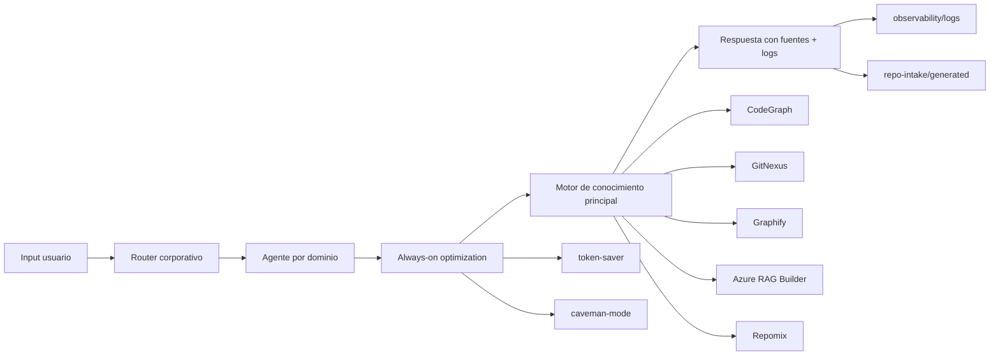
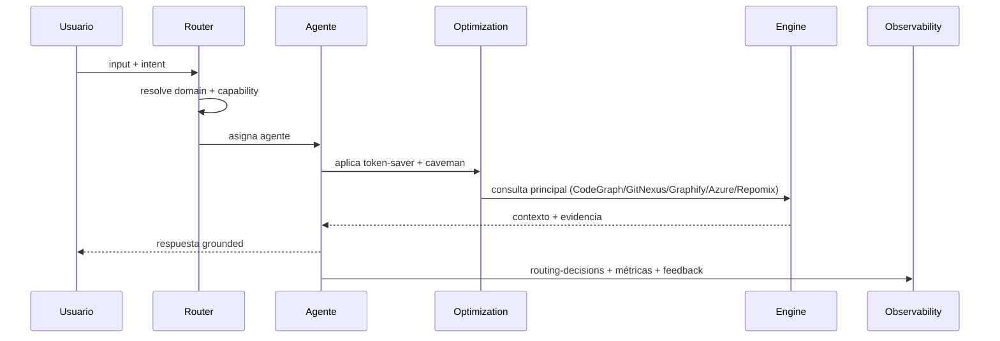
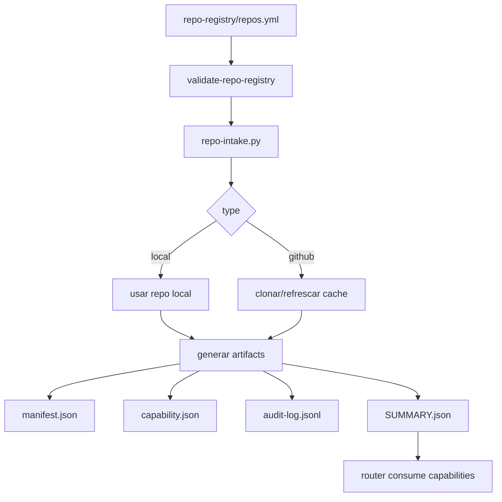
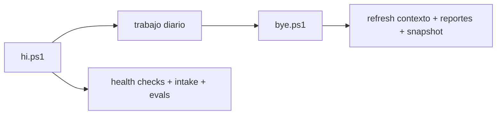
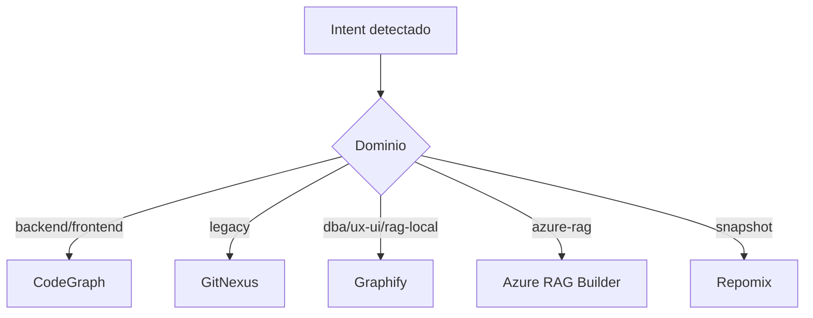
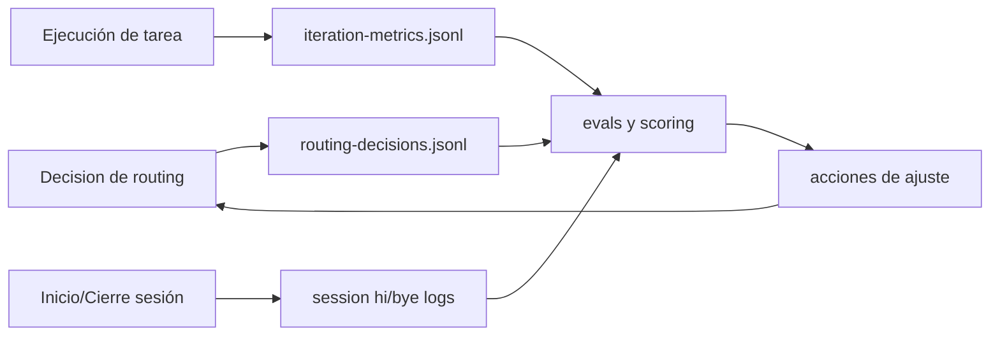
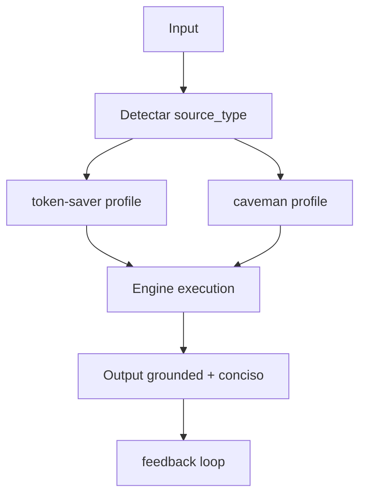
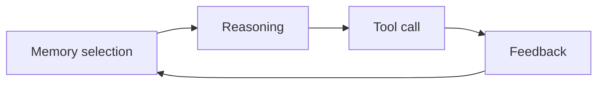
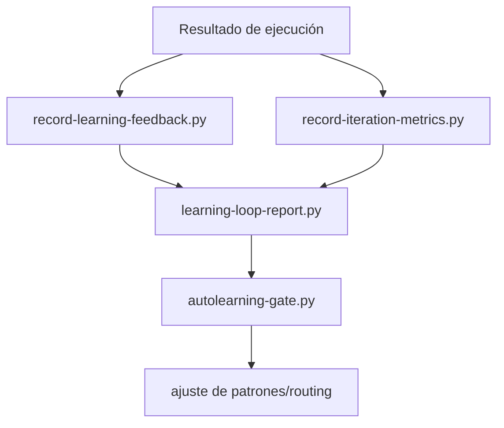

# MCP Efficiency Engine

Motor de orquestación para agentes MCP con routing por dominio, optimización always-on y contratos de intake JSON-first.

## Objetivo

Este repositorio centraliza:

- Routing corporativo de intención -> agente -> motor.
- Ingesta de repos "boost" (locales o GitHub) a capacidades consumibles.
- Optimización operacional (`token-saver` + `caveman`) sin perder grounding.
- Observabilidad de decisiones de routing, uso y aprendizaje continuo.

## Arquitectura



## Flujos Operativos

### Flujo End-to-End De Routing



### Flujo De Intake (Registry -> Capability)



### Flujo Diario Recomendado



## Routing Base

Contrato global en `AGENTS.md`:

- `backend` -> `CodeGraph`
- `frontend-agent` -> `CodeGraph`
- `legacy` -> `GitNexus`
- `dba` -> `Graphify`
- `ux-ui` -> `Graphify`
- `rag-local` -> `Graphify`
- `rag-azure` -> `Azure RAG Builder`
- `iot` -> `GitNexus/CodeGraph + Graphify`
- `community-manager` -> `Graphify`
- `snapshot` -> `Repomix`

## Motores Y Herramientas

### Motores Principales

| Motor | Uso principal | Cuándo usarlo |
|---|---|---|
| CodeGraph | Código repo único, símbolos y call paths | bug/fix/refactor backend o frontend en un repo |
| GitNexus | Impacto multi-repo, legacy, dependencias | migraciones legacy, análisis de blast radius, seguridad de cambio |
| Graphify | Documentación técnica local y relaciones de conocimiento | dba, ux-ui, rag-local, análisis de docs estructurados |
| Azure RAG Builder | Contexto corporativo y fuentes enterprise | contratos, políticas, evidencia corporativa |
| Repomix | Snapshot/export de contexto | empaquetado de contexto y handoff portable |

### Tooling Operativo Del Repo

| Tooling | Rol en el sistema |
|---|---|
| token-saver-mcp | reducción de contexto y coste sin perder evidencia |
| caveman-mode | simplificación de salida y disciplina de respuesta |
| codebase-memory-mcp | memoria persistente para patrones y feedback |
| scripts/intake/* | validación de registry, generación de capabilities y resolución de routing |
| scripts/ops/hi.ps1, scripts/ops/bye.ps1 | ciclo operativo de inicio/cierre con checks y refresh |
| observability/logs/* | trazabilidad de decisiones, métricas y aprendizaje |

### Mapa Rápido Intent -> Motor



## Estructura Clave

- `.github/agents/`: definición de agentes por dominio.
- `.github/skills/`: skills ejecutables y reutilizables.
- `.github/prompts/`: prompts de routing por caso.
- `orchestrator/`: reglas corporativas y matriz de decisión.
- `repo-registry/`: registro de boosts aprobados.
- `repo-intake/`: generación de manifests/capabilities/audit.
- `scripts/`: setup, intake, operaciones, contexto y learning.
- `observability/`: esquemas, métricas y evaluaciones.
- `projects/`: artefactos operativos por proyecto.

## Quickstart (Windows)

### 1) Setup inicial

```powershell
.\scripts\setup\setup-prerequisites.ps1
```

### 2) Validación mínima

```powershell
.\scripts\setup\validate-context.ps1
.\scripts\intake\run-repo-intake.cmd
py -3 .\scripts\intake\run-routing-evals.py
```

### 3) Operación diaria

```powershell
.\scripts\ops\hi.ps1
# ... trabajo ...
.\scripts\ops\bye.ps1
```

Validación extendida recomendada:

```powershell
py -3 .\scripts\intake\agent-pipeline-preflight.py
py -3 .\scripts\intake\validate-repo-registry.py --strict
```

## Flujo De Intake

`repo-intake` soporta dos modos:

- `type=local`: consume un repo existente en disco.
- `type=github`: clona/refresca cache local y genera los mismos artefactos.

Artefactos canónicos:

- `repo-intake/generated/<slug>/context-manifests/manifest.json`
- `repo-intake/generated/<slug>/capabilities/capability.json`
- `repo-intake/generated/<slug>/audit/audit-log.jsonl`
- `repo-intake/generated/reports/SUMMARY.json`

## Observabilidad

Registros principales:

- `observability/logs/routing-decisions.jsonl`
- `observability/logs/iteration-metrics.jsonl`
- `observability/logs/session/hi-*.json`
- `observability/logs/session/bye-*.json`

Eventos clave que conviene revisar:

- decisiones de routing: agente, engine, fallback, grounding.
- requirements runtime por ruta resuelta.
- métricas por iteración (tokens/coste si se reportan).
- feedback de learning para mejorar rutas futuras.

### Loop De Observabilidad



## Optimización Always-On

Pilares:

- `token-saver`: reduce contexto sin romper grounding.
- `caveman`: simplifica salida y reduce ruido operacional.
- Selección de perfil por tipo de fuente (`code`, `technical-docs`, `corporate-docs`, `snapshot`).



Referencias:

- `optimization/ALWAYS_ON_OPTIMIZATION.md`
- `optimization/token-saver.md`
- `optimization/caveman-mode.md`

## Policies Y Guardrails

Políticas activas para gobierno, coste, seguridad y intake:

- `policies/context-policy.md`
- `policies/cost-policy.md`
- `policies/security-policy.md`
- `policies/repo-intake-policy.md`

Reglas operativas clave:

- No mezclar todos los motores a la vez.
- Priorizar evidencia y fuentes cuando aplique.
- En cambios de alto impacto, activar confirmación humana (HITL).
- Mantener outputs de proyecto dentro de `projects/<nombre>/`.

## Tooling Operativo

Mapa de toolchain por fase:

| Fase | Scripts/Tools |
|---|---|
| Setup | `scripts/setup/setup-prerequisites.ps1`, `scripts/setup/validate-context.ps1` |
| Intake | `scripts/intake/validate-repo-registry.py`, `scripts/intake/repo-intake.py`, `scripts/intake/run-repo-intake.cmd` |
| Routing/Evals | `scripts/intake/resolve-routing.py`, `scripts/intake/run-routing-evals.py`, `scripts/intake/agent-pipeline-preflight.py` |
| Daily Ops | `scripts/ops/hi.ps1`, `scripts/ops/bye.ps1` |
| Learning | `scripts/learning/*` |

## Memory Y AutoLearning Loops

### Memory-First

La secuencia efectiva de ejecución sigue este orden:

1. Selección de memoria relevante.
2. Razonamiento con contexto persistido.
3. Uso de herramientas si hace falta.
4. Registro de aprendizaje.



### AutoLearning



Artefactos y docs relacionadas:

- `autolearning/feedback-loop.md`
- `memory/cross-memory-reasoning.md`
- `scripts/learning/learning-loop-report.py`
- `scripts/learning/autolearning-gate.py`

## Documentación Recomendada

- `FINAL_USAGE_GUIDE.md`
- `ARCHITECTURE.md`
- `AGENTS.md`
- `docs/01-onboarding.md`
- `optimization/ALWAYS_ON_OPTIMIZATION.md`
- `scripts/README.md`

## Convenciones Operativas

- JSON-first para artefactos operativos y reportes.
- Cambios mínimos y seguros; evitar refactors fuera de scope.
- Outputs específicos por proyecto dentro de `projects/<nombre>/`.
- Diagnósticos MCP Efficiency Engine preferentemente en `projects/<nombre>/analysis_mcpee/`.

## Licencia

MIT. Ver `LICENSE`.
