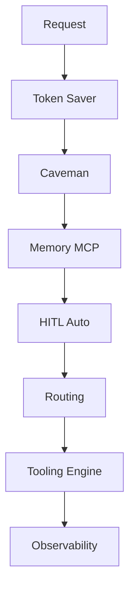

# Always-On Optimization Guide

## Qué cambia

Caveman y Token Saver ya no son opcionales. Están activos para todo.

```txt
Token Saver -> siempre optimiza contexto.
Caveman -> siempre optimiza respuesta.
```

## Cómo se aplica en GitHub Copilot

La activación vive en:

- `.github/copilot-instructions.md`
- `.github/instructions/always-on-optimization.instructions.md`
- `.github/skills/token-saver/SKILL.md`
- `.github/skills/caveman-mode/SKILL.md`

Runtime MCP local para Token Saver:

- `.vscode/mcp.json`

Servidor esperado:

- `token-saver-mcp`

## Memoria y HITL (Always-On)

- Memoria operacional no sensible se cachea automaticamente (patrones, metricas, decisiones tecnicas y estado de salud).
- No se pide confirmacion para cachear hallazgos internos del repo.
- HITL se activa en modo auto cuando detecta riesgo alto.
- HITL pide confirmacion humana en rutas de alto impacto o fallback.
- HITL bloquea hasta aprobacion humana en acciones destructivas.
- Nunca se cachean secretos, credenciales, tokens ni PII.

## Cómo se aplica por tarea

| Tarea | Perfil |
| --- | --- |
| Bug/debug | Token Saver strict + Caveman full |
| SQL/DBA | Token Saver strict + Caveman lite/full |
| Azure RAG | Token Saver evidence-first + Caveman evidence-first |
| Formación | Token Saver balanced + Caveman didactic-lite |
| Arquitectura | Token Saver balanced + Caveman lite |

## Regla clave

Caveman no significa “responder mal por corto”. Significa:

```txt
menos paja, misma claridad.
```

Token Saver no significa “perder fuentes”. Significa:

```txt
menos contexto inútil, misma evidencia.
```

## Checklist Operativo (Producción)

1. Validar contexto base:

```powershell
.\scripts\setup\validate-context.ps1
```

1. Validar intake/routing:

```powershell
.\scripts\intake\run-repo-intake.cmd
py -3 .\scripts\intake\run-routing-evals.py
```

1. Revisar reporte de evals:

- `observability/evals/routing-eval-report.json`
- Esperado: `cases_failed = 0`.

1. Revisar logs de decisiones:

- `observability/logs/routing-decisions.jsonl`
- Verificar `grounded=false` cuando no haya `sources`.
- Verificar bloque `hitl` en eventos de riesgo (`required=true`, `action!=none`).

1. Revisar refresh de memoria operacional:

- `context/project-notes/decisions.md`
- `context/project-notes/glossary.md`
- `context/project-notes/known-risks.md`
- `context/repomix/repomix-output.xml`

1. Revisar MCP runtime clave:

- `.vscode/mcp.json`
- Servidores base resolubles: `token-saver-mcp`, `codebase-memory-mcp`, `codegraph`, `gitnexus`, `repomix`, `graphify`.

<!-- diagramas-v1 -->
## Diagrama Visual Always-On


