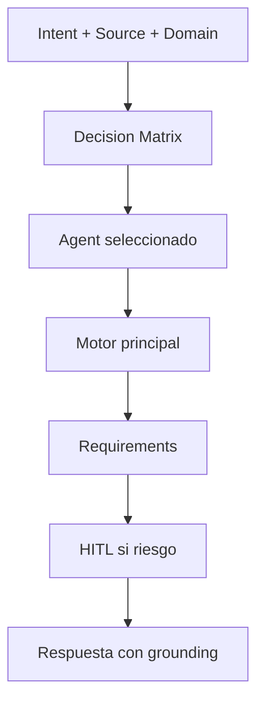

<!-- markdownlint-disable MD013 -->

# MCP Routing Guide

No usar todos los MCP a la vez. Usar routing corporativo para elegir 1 agente + 1 motor principal por tarea.

## Objetivo

- Resolver `agent`, `engine` y `capability` en base a intencion, dominio y tipo de fuente.
- Aplicar Always-On de forma transversal: Token Saver, Caveman, Memory, Learning y HITL.

## Motor de decision

Implementacion principal:

- `scripts/intake/resolve-routing.py`

Comando de prueba:

```powershell
py -3 .\scripts\intake\resolve-routing.py --input "Plan de migracion legacy" --intent migration --domain legacy --source-type code --capability legacy-migration
```

## Campos clave de salida

- `agent`
- `engine`
- `capability`
- `prompt.selected`
- `hitl.mode`
- `hitl.required`
- `hitl.action`

## Reglas practicas

1. Si el problema es de codigo vivo de backend en repo unico: prioriza `backend` con CodeGraph.
2. Si el problema es de implementacion/correccion de UI en codigo frontend: prioriza `frontend-agent` con CodeGraph.
3. Si el problema es de criterios de diseno, accesibilidad, consistencia o design system: prioriza `ux-ui` con Graphify.
4. Si es legacy/migracion/multi-repo: prioriza `legacy` con GitNexus.
5. Si es conocimiento tecnico local: prioriza `rag-local` con Graphify.
6. Si es contrato/politica corporativa: prioriza `rag-azure` con Azure RAG.
7. Si hay riesgo alto o fallback: HITL en modo auto pide confirmacion.
8. Si la tarea es consolidar/proyectar conocimiento tecnico incremental a wiki:
  prioriza `wiki-agent` con CodeGraph (fallback Graphify).

## Frontera frontend vs ux-ui

- `frontend` = trabajo sobre codigo UI ejecutable: componentes, rutas, estado, eventos, render.
- `ux-ui` = gobernanza y calidad UX/UI: heuristicas, accesibilidad, consistencia, design intent y design system.
- Si llega `source_type=technical-docs` con dominio ambiguo, resolver a `ux-ui`.
- Si llega `source_type=code` con intent de implementacion/fix/refactor UI, resolver a `frontend`.

## Mapa rapido

| Intencion/Dominio | Agente esperado | Motor esperado |
| --- | --- | --- |
| bug-fix + backend | backend | CodeGraph |
| feature/bug-fix + frontend | frontend-agent | CodeGraph |
| review/accesibilidad/design-system + ux-ui | ux-ui | Graphify |
| migration + legacy | legacy | GitNexus |
| query + dba | dba | Graphify |
| compile/proyeccion wiki | wiki-agent | CodeGraph |
| docs tecnicas locales | rag-local | Graphify |
| contratos/SLA/politicas | rag-azure | Azure RAG Builder |

## Validacion minima

```powershell
py -3 .\scripts\intake\run-routing-evals.py
```

Esperado:

- `cases_failed = 0`

<!-- diagramas-v1 -->
## Diagrama Visual De Routing MCP



