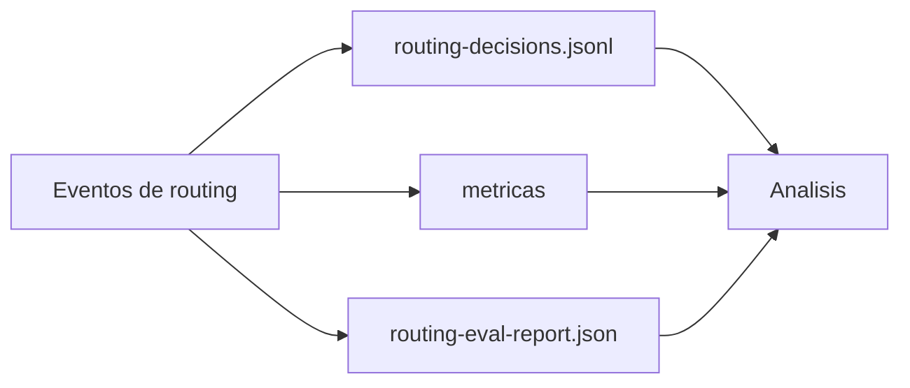

# Observability Guide

Mide routing accuracy, tool misuse, grounding, gaps, token efficiency y caveman effectiveness.

## Objetivo

- Tener trazabilidad de cada decision de routing.
- Detectar desviaciones de calidad antes de que escalen.
- Medir si Always-On esta funcionando como se espera.

## Fuentes principales

- `observability/logs/routing-decisions.jsonl`
- `observability/evals/routing-eval-report.json`
- `observability/evals/learning-loop-report.json`
- `observability/evals/iteration-value-report.json`
- `observability/logs.schema.json`

## Que revisar en cada evento

1. `agent`, `engine`, `capability` coherentes con la intencion.
2. `grounded` y `sources` coherentes con el tipo de consulta.
3. `prompt.selected` y `prompt.exists=true`.
4. `hitl.required=true` en rutas de alto riesgo.
5. `hitl.action=block` para acciones destructivas.

## Validacion rapida

```powershell
py -3 .\scripts\intake\run-routing-evals.py
```

Resultado esperado:

- `cases_failed = 0`

## Señales de alerta

- `prompt.exists=false` repetido.
- `grounded=false` en consultas que requieren fuentes.
- `hitl.required=false` en tareas de alto impacto.
- salto frecuente a fallback sin motivo claro.

## Accion recomendada ante alertas

1. Corregir reglas en `scripts/intake/resolve-routing.py`.
2. Reejecutar evals.
3. Registrar decision y riesgo en `context/project-notes/known-risks.md`.

<!-- diagramas-v1 -->
## Diagrama Visual De Observabilidad


