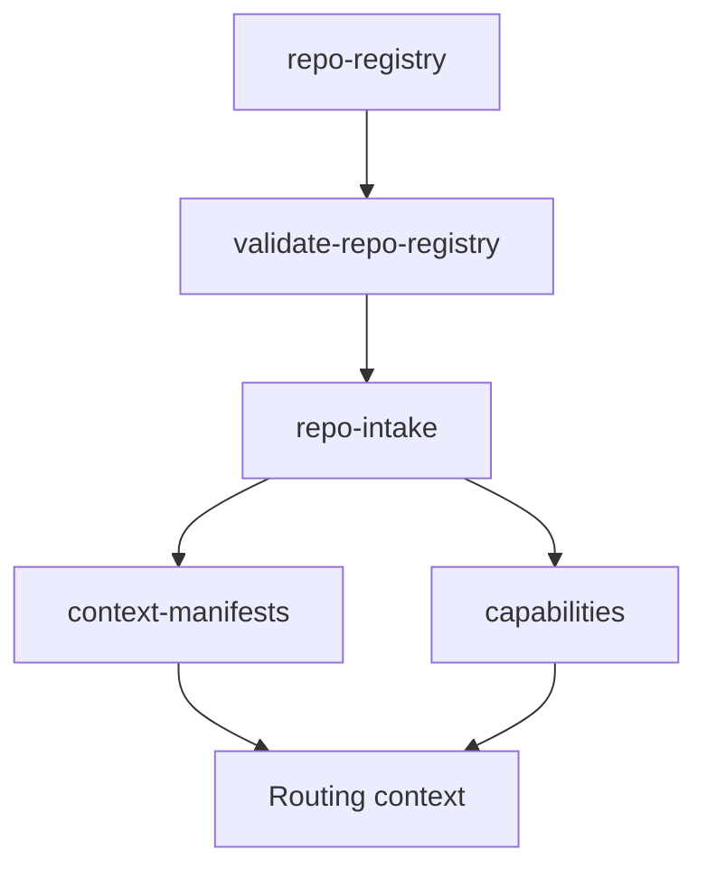

# Repo Intake Guide

Repo Intake convierte repos externos en capacidades sin copiarlos.

## Flujo recomendado (local-first)

1. Registrar repos hermanos en `repo-registry/repos.yml` (formato JSON-first con `schema_version: 2.0`).
1. (Opcional) Detectar nuevos repos `boost_*` en `c:/repo` sin aplicar cambios con `.\scripts\discovery\discover-boost-repos.cmd`.
1. Revisar propuesta generada en `repo-intake/generated/reports/boost-discovery-proposal.json`.
1. Aplicar automáticamente candidatos nuevos (si quieres) con `.\scripts\discovery\discover-boost-repos.cmd --apply`.
1. Validar governance y dependencias con `pwsh -NoProfile -ExecutionPolicy Bypass -File .\scripts\intake\validate-repo-registry.ps1 -Strict`.
1. Ejecutar intake con `.\scripts\intake\run-repo-intake.cmd`.

## Campos mínimos por repo

- `name`
- `domain` (`dev|legacy|dba|iot|azure-rag`)
- `location` (ruta local)
- `type` (`local`)
- `approval.status` (`approved`)
- `approval.approved_by`
- `approval.approved_date`

Campos opcionales:

- `optional: true` para repos de ejemplo no clonados localmente.
- `dependencies` para declarar relaciones entre repos hermanos.

## Artefactos generados

- Canonico plano por repo: `repo-intake/generated/<slug>/`
- Manifest: `repo-intake/generated/<slug>/context-manifests/manifest.json`
- Capability: `repo-intake/generated/<slug>/capabilities/capability.json`
- Audit log: `repo-intake/generated/<slug>/audit/audit-log.jsonl`
- Reportes operativos JSON: `repo-intake/generated/reports/*.json`

## Validación estricta

- Bloquea: campos obligatorios faltantes.
- Bloquea: repos duplicados.
- Bloquea: dependencias desconocidas.
- Bloquea: ciclos de dependencias.
- Bloquea: repos no aprobados.
- Warning permitido: repo marcado `optional: true` cuya `location` no existe localmente.

<!-- diagramas-v1 -->
## Diagrama Visual De Repo Intake

