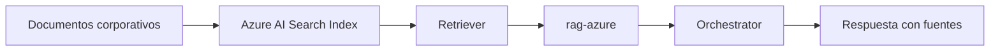

# Azure RAG Builder Integration

RAG Azure Builder es el backend de grounding corporativo. El routing decide cuando invocarlo con `rag-azure`.

## Cuando usarlo

- Consultas sobre contratos, SLA, politicas y documentos corporativos.
- Casos que requieren fuentes verificables fuera del repositorio local.

## Flujo

1. Entrada de usuario.
2. `resolve-routing.py` detecta `domain=azure-rag` o `corporate-docs`.
3. Selecciona `rag-azure`.
4. Se aplica prompt de consulta documental.
5. Se devuelve respuesta con grounding.

## Validacion rapida

```powershell
py -3 .\scripts\intake\resolve-routing.py --input "Que dice la politica de retencion?" --intent query --domain azure-rag --source-type corporate-docs --capability policy-lookup
```

Esperado:

- `agent = rag-azure`
- `engine` asociado a Azure RAG
- `prompt.selected` de consulta documental

## Guardrails

- No usar Azure RAG para modificar codigo.
- Si faltan fuentes, declarar gap explicitamente.
- Si el caso escala a riesgo alto, activar HITL.

<!-- diagramas-v1 -->
## Diagrama Visual Azure RAG



