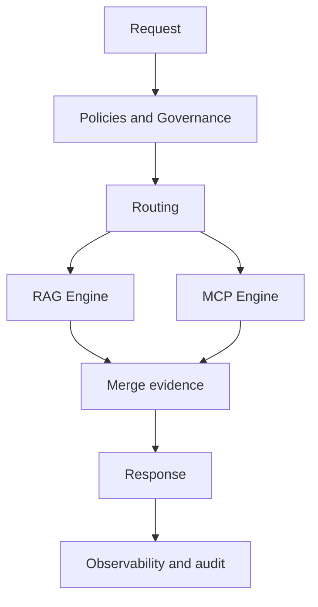

# RAG MCP Production Guide PRO

RAG local explica; Azure RAG encuentra documentos reales; MCP ejecuta sobre codigo vivo; Repomix exporta contexto.

## Objetivo

Operar en produccion con grounding, trazabilidad y control de riesgo.

## Checklist de salida a produccion

1. Routing evals en verde (`cases_failed = 0`).
2. Logs de decisiones activos y validos.
3. HITL activo para rutas de alto impacto.
4. Politica de memoria aplicada (sin secretos/PII).
5. Refresh de contexto (`project-notes` y `repomix`) automatizado.

## Operacion diaria

Arranque:

```powershell
.\scripts\ops\hi.ps1
```

Cierre:

```powershell
.\scripts\ops\bye.ps1
```

## Riesgos tipicos

- Respuesta sin fuentes en consultas de politica.
- Uso de motor incorrecto por metadatos de entrada pobres.
- Falta de confirmacion humana en acciones de alto impacto.

## Mitigacion

1. Ajustar reglas de routing.
2. Reejecutar evals.
3. Registrar hallazgo en `context/project-notes/known-risks.md`.

<!-- diagramas-v1 -->
## Diagrama Visual De Produccion RAG + MCP


