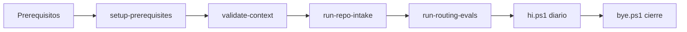

# Onboarding

## 1) Prerequisitos

- Windows + PowerShell
- Node.js + npm (para `token-saver-mcp`, `codegraph`, `gitnexus`)
- Python 3
- `uv` (para `graphify`)

## 2) Setup inicial (una sola vez)

```powershell
.\scripts\setup\setup-prerequisites.ps1
```

Opciones útiles si quieres saltar algún componente:

```powershell
.\scripts\setup\setup-prerequisites.ps1 -SkipGraphify
.\scripts\setup\setup-prerequisites.ps1 -SkipCodebaseMemory
```

## 3) Validación mínima

```powershell
.\scripts\setup\validate-context.ps1
.\scripts\intake\run-repo-intake.cmd
python .\scripts\intake\run-routing-evals.py
```

## 4) Lectura recomendada

- `README.md`
- `FINAL_USAGE_GUIDE.md`
- `ARCHITECTURE.md`
- `optimization/ALWAYS_ON_OPTIMIZATION.md`
- `scripts/README.md`

Mapa de politicas:

- Gobierno: `policies/*.md`
- Optimizacion always-on: `optimization/policies/*.md`

## 4.1) Regla de alcance para proyectos

- El trabajo operativo sobre proyectos debe centrarse en `projects/`.
- Todo entregable, nota, documento o artefacto especifico de un proyecto debe
  guardarse dentro de `projects/<nombre-proyecto>/`.
- Los analisis y diagnosticos generados por MCP Efficiency Engine deben
  guardarse preferentemente en `projects/<nombre-proyecto>/analysis_mcpee/`.
- Los subagentes no deben sacar artefactos especificos de proyecto a la raiz
  del repositorio.

## 4.2) Primera pasada profunda por boost

- La primera vez que un agente entre en un boost, capability o proyecto nuevo,
  debe hacer onboarding profundo antes de pasar a modo optimizado.
- Esa primera pasada debe intentar recuperar la maxima informacion verificable
  relevante, aunque tarde mas, priorizando fuentes canonicas sobre resumenes
  parciales.
- Orden recomendado de contexto en la primera pasada:
  1. `repo-intake/generated/<slug>/`
  2. `docs/01-onboarding.md` y documentacion base del repo
  3. instrucciones locales `.github/instructions/`
  4. skills locales `.github/skills/`
  5. agentes locales `.github/agents/`
  6. prompts locales `.github/prompts/`
  7. documentacion y artefactos especificos del proyecto en `projects/`
- Si hay agentes o subagentes especializados del boost, deben usarse o, como
  minimo, leerse y aplicarse como marco operativo de la tarea.
- Tras esa primera pasada, el agente puede volver a estrategia de contexto
  minimo y ejecucion optimizada.

## 5) Arranque y cierre diarios

Arranque automatizado profundo (valida contexto + memoria/cache + MCP operativos + repos hermanos + intake + evals + estado CodeGraph):

```powershell
.\scripts\ops\hi.ps1
```

`hi.ps1` tambien refresca automaticamente `context/project-notes/*` desde observabilidad.

Cierre automatizado (valida registry + refresca grafo/intake/discovery + evals + snapshot git + estado CodeGraph):

```powershell
.\scripts\ops\bye.ps1
```

`bye.ps1` tambien refresca automaticamente `context/repomix/repomix-output.xml` y `context/project-notes/*`.

Confirmaciones humanas:

- Solo para decisiones/acciones de riesgo (HITL always-on auto).
- En rutas de bajo riesgo, no pide confirmacion.

Opciones utiles:

```powershell
.\scripts\ops\hi.ps1 -SetupIfNeeded
.\scripts\ops\hi.ps1 -SkipIntake -SkipRoutingEvals
.\scripts\ops\hi.ps1 -SkipMcpStartupChecks -SkipSiblingReposChecks
.\scripts\ops\hi.ps1 -SkipAgentPipelinePreflight
.\scripts\ops\hi.ps1 -SkipProjectNotesRefresh
.\scripts\ops\bye.ps1 -SkipGitSnapshot
.\scripts\ops\bye.ps1 -SkipGraphRefresh -SkipIntakeRefresh -SkipSiblingDiscoveryRefresh
.\scripts\ops\bye.ps1 -SkipRepomixRefresh
.\scripts\ops\bye.ps1 -SkipProjectNotesRefresh
```

## 6) Agentes ad-hoc en VS Code

Los agentes detectables para `set agent` viven en:

- `.github/agents/*.agent.md`

Validacion de tuberia agente -> skills -> boost:

```powershell
py -3 .\scripts\intake\agent-pipeline-preflight.py
```

Si faltan definiciones `.agent.md`, puedes generar plantillas:

```powershell
py -3 .\scripts\intake\agent-pipeline-preflight.py --create-missing-templates
```

Reportes de sesion:

- `observability/logs/session/hi-*.json`
- `observability/logs/session/bye-*.json`

<!-- diagramas-v1 -->
## Diagrama Visual De Onboarding


