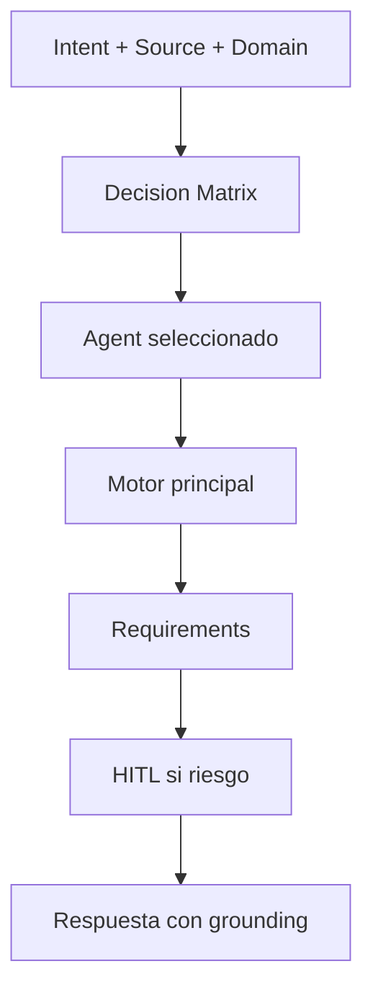

# MCP Routing Guide

No usar todos los MCP a la vez. Usar routing corporativo para elegir 1 agente + 1 motor principal por tarea.

## Objetivo

- Resolver `agent`, `engine` y `capability` en base a intencion, dominio y tipo de fuente.
- Aplicar Always-On de forma transversal: Token Saver, Caveman, Memory, Learning y HITL.

## Motor de decision

Implementacion principal:

- `scripts/intake/resolve-routing.py`

Comando de prueba:

```powershell
py -3 .\scripts\intake\resolve-routing.py --input "Plan de migracion legacy" --intent migration --domain legacy --source-type code --capability legacy-migration
```

## Campos clave de salida

- `agent`
- `engine`
- `capability`
- `prompt.selected`
- `hitl.mode`
- `hitl.required`
- `hitl.action`

## Reglas practicas

1. Si el problema es de codigo vivo de un repo unico: prioriza `dev-agent` con CodeGraph.
2. Si es legacy/migracion/multi-repo: prioriza `legacy-agent` con GitNexus.
3. Si es conocimiento tecnico local: prioriza `rag-local-agent` con Graphify.
4. Si es contrato/politica corporativa: prioriza `rag-azure-agent` con Azure RAG.
5. Si hay riesgo alto o fallback: HITL en modo auto pide confirmacion.

## Mapa rapido

| Intencion/Dominio | Agente esperado | Motor esperado |
| --- | --- | --- |
| bug-fix + dev | dev-agent | CodeGraph |
| migration + legacy | legacy-agent | GitNexus |
| query + dba | dba-agent | Graphify |
| docs tecnicas locales | rag-local-agent | Graphify |
| contratos/SLA/politicas | rag-azure-agent | Azure RAG Builder |

## Validacion minima

```powershell
py -3 .\scripts\intake\run-routing-evals.py
```

Esperado:

- `cases_failed = 0`

<!-- diagramas-v1 -->
## Diagrama Visual De Routing MCP


