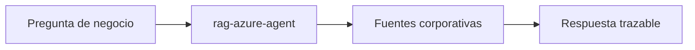

# azure-rag-corporate-docs

## Escenario

Consulta de SLA/politica corporativa con necesidad de fuentes verificables.

## Prompt de ejemplo

"Que dice el SLA sobre tiempos de respuesta en incidencias criticas?"

## Ruta esperada

- `agent`: `rag-azure-agent`
- `engine`: Azure RAG Builder
- `source_type`: `corporate-docs`

## Validacion

```powershell
py -3 .\scripts\intake\resolve-routing.py --input "Que dice el SLA sobre tiempos de respuesta en incidencias criticas?" --intent query --domain azure-rag --source-type corporate-docs --capability policy-lookup
```

<!-- diagramas-v1 -->
## Diagrama Visual Del Caso De Uso


