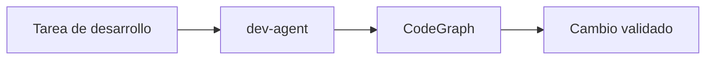

# dev-modern

## Escenario

Corregir bug en codigo moderno de un repo unico.

## Prompt de ejemplo

"Arregla el bug de autenticacion en login y valida tests."

## Ruta esperada

- `agent`: `dev-agent`
- `engine`: CodeGraph
- `intent`: `bug-fix`

## Validacion

```powershell
py -3 .\scripts\intake\resolve-routing.py --input "Arregla el bug de autenticacion en login y valida tests" --intent bug-fix --domain dev --source-type code --capability code-fix
```

<!-- diagramas-v1 -->
## Diagrama Visual Del Caso De Uso


