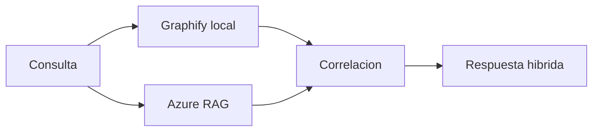

# hybrid-graphify-azure-rag

## Escenario

Necesitas explicacion tecnica local + fuentes corporativas externas.

## Prompt de ejemplo

"Explica el flujo de auth del sistema y añade fuentes de politica corporativa relacionadas."

## Ruta esperada

- Base local: Graphify (conocimiento tecnico local)
- Apoyo documental: Azure RAG Builder (fuentes corporativas)

## Validacion

```powershell
py -3 .\scripts\intake\resolve-routing.py --input "Explica el flujo de auth del sistema y añade fuentes de politica corporativa relacionadas" --intent explain --domain azure-rag --source-type hybrid-docs --capability hybrid-knowledge
```

<!-- diagramas-v1 -->
## Diagrama Visual Del Caso De Uso


