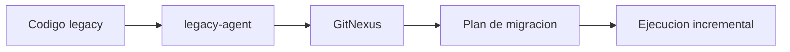

# legacy-migration

## Escenario

Analizar impacto previo a migracion o refactor en stack legacy.

## Prompt de ejemplo

"Analiza impacto de migrar modulo legacy de facturacion."

## Ruta esperada

- `agent`: `legacy-agent`
- `engine`: GitNexus
- `intent`: `migration`

## Validacion

```powershell
py -3 .\scripts\intake\resolve-routing.py --input "Analiza impacto de migrar modulo legacy de facturacion" --intent migration --domain legacy --source-type code --capability legacy-migration
```

<!-- diagramas-v1 -->
## Diagrama Visual Del Caso De Uso


